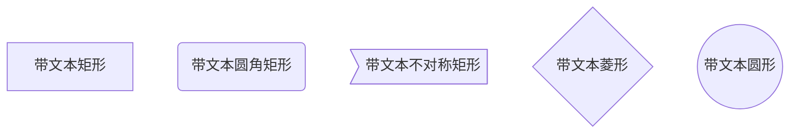
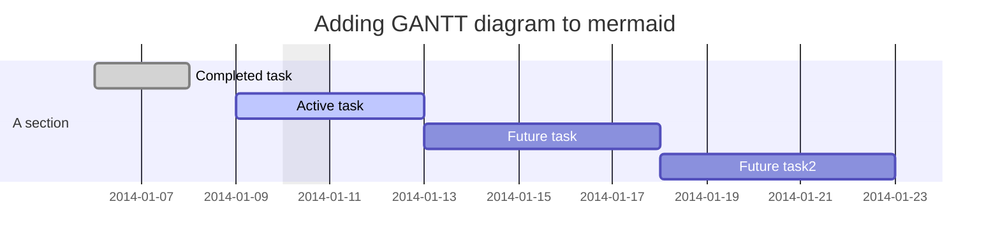

# markdown

mermaid 

flow 流

sequence 时序图

api 接口文档

```mermaid
graph TD
    a1[带文本矩形]
    a2(带文本圆角矩形)
    a3>带文本不对称矩形]
    b1{带文本菱形}
    c1((带文本圆形))
```

```mermaid
graph TD;
    A-->B;
    A-->C;
    B-->D;
    C-->D;
```

# 

```mermaid
gantt
dateFormat  YYYY-MM-DD
title Adding GANTT diagram to mermaid
excludes weekdays 2014-01-10

section A section
Completed task            :done,    des1, 2014-01-06,2014-01-08
Active task               :active,  des2, 2014-01-09, 3d
Future task               :         des3, after des2, 5d
Future task2               :         des4, after des3, 5d
```

